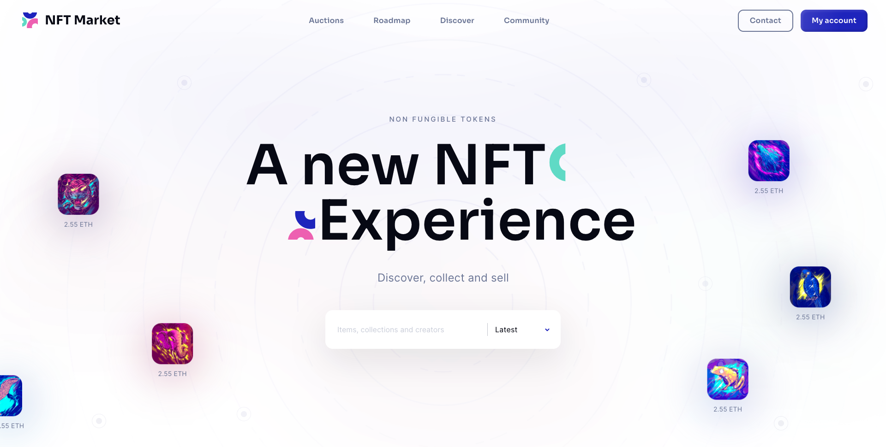

# NFT Market

An NFT marketplace website

## Table of contents

- [Overview](#overview)
  - [Functionality](#functionality)
  - [Screenshot](#screenshot)
  - [Link](#link)
- [My process](#my-process)
  - [Built with](#built-with)
- [Author](#author)

## Overview

This website developed with Nuxt framework and behind the scene it uses server-side rendering technology. All data (NFT images, users) downloading on server-side dynamically.
Unsplah API is used for fetching photos. Random users generated with Randomname.de API.

Current NFT is keep tracking, even after refreshing the page (сookies are used for this).

You can add a new bet on any NFT`s page. New data will be saved at Vuex store and item chart will be updated.

Every NFT has expire time. When the time is up, making a new bet will be denied, new NFT on main page will be generated.

### Functionality

Users are able to:

- View the optimal layout for the app depending on their device's screen size
- See hover states for all interactive elements on the page
- Make a bet on NFT page.
- Receive form validations if incorrect price
- See a bid confirmation push
- Search in two categories
- Download more NFTs
- Mark NFT as liked

### Screenshot

### Link

- Live Site URL: [Demo](https://audiophile-shop.herokuapp.com/)

## My process

### Built with

- [Vue.js](https://vuejs.org/) - JS framework
- [Vuex.js](https://vuex.vuejs.org/) - State manager
- [SCSS](https://sass-lang.com/) - CSS pre-processor
- [Nuxt.js](https://nuxtjs.org/) - SSR framework
- [Chart.js](https://www.chartjs.org/) - Charts
- [Random User API](https://randomname.de) - API for fetching random people
- [Unsplash API](https://unsplash.com/documentation) - API for fetching random photos
- [AOS](https://michalsnik.github.io/aos/) - Animate on scroll library
- [Vue-Kinesis](https://www.npmjs.com/package/vue-kinesis) - Interactive animations
- [Vue-Awesome-Swiper](https://www.npmjs.com/package/vue-awesome-swiper) - Slider library

## Author

- Telegram - [@kuznetsovtm](https://t.me/@kuznetsovtm)
